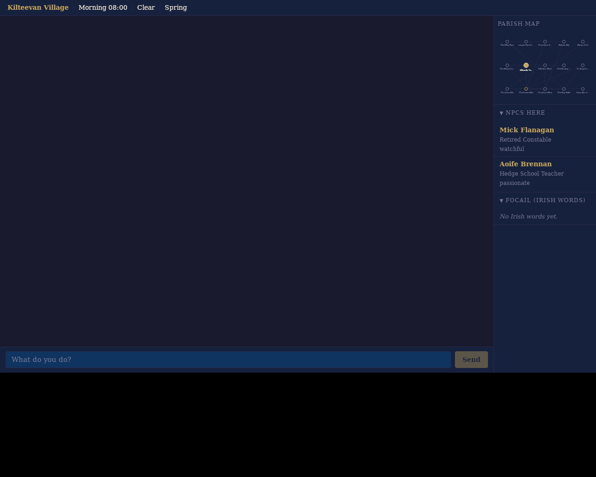

# Rundale

An Irish Living World Text Adventure built in Rust, set in 1820. Powered by the **Parish** engine.

The player arrives as a newcomer to **Kilteevan Village** in the parish of Kiltoom, near Roscommon, County Roscommon. NPCs are driven by local LLM inference (via any OpenAI-compatible provider — Ollama, LM Studio, OpenRouter, or custom). A cognitive level-of-detail (LOD) system simulates hundreds of NPCs at varying fidelity based on proximity to the player.

> Any resemblance to real persons, living or dead, or actual businesses is purely coincidental. All characters and commercial establishments in this game are fictional.



*Tauri GUI showing the chat panel, interactive map, NPC sidebar, and time-of-day color theming (morning palette).*

## Current Status

**Phases 1–4 complete** (Core Loop, World Graph, NPCs & Simulation, Persistence). **Phase 5 — Full LOD & Scale** is in progress: sub-phases 5A–5E are done (event bus, weather state machine, long-term memory & gossip, Tier 3 batch inference, Tier 4 rules engine & seasonal effects), and 5F (world graph expansion to Roscommon/Athlone/Dublin) is the next open item. **Phase 8 — Tauri GUI** is landed (one screenshot-capture polish item outstanding).

See the [Roadmap](docs/requirements/roadmap.md) for per-item status tracking.

## Quick Start

The workspace ships with a [`justfile`](justfile); run `just --list` for the full set of recipes.

**Requirements:** Rust (edition 2024), [Node.js](https://nodejs.org/) (v20+), [`just`](https://github.com/casey/just) (`cargo install just` or your package manager's equivalent), and an OpenAI-compatible LLM endpoint (e.g. [Ollama](https://ollama.ai/) on `localhost:11434`, LM Studio, OpenRouter, or a custom provider configured in `parish.toml`).

```sh
# One-time: install system deps, Rust, Node, and frontend packages
just setup
```

### GUI Mode (Tauri Desktop App)

The default experience is a Tauri 2 desktop app with a Svelte 5 frontend.

```sh
just run          # launches cargo tauri dev
```

### Headless Mode (Terminal REPL)

Plain stdin/stdout REPL — useful for scripting, fixtures, and servers without a display:

```sh
just run-headless
```

On startup, a save picker shows existing save files (in `saves/`) with their timeline branches, or lets you start a new game. In-game, use `/load` to switch saves, `/save` to snapshot, `/fork <name>` to branch timelines.

### Web Server

An Axum backend in `crates/parish-server` serves the Svelte UI over WebSockets (see [OAuth setup](docs/oauth-setup.md) and the `deploy/` artifacts for Dockerfile + Railway config).

**Platform guides:** [macOS](docs/macos-setup.md) | [Linux](docs/linux-setup.md) | [Windows](docs/windows-setup.md)

## Documentation

The documentation is organized hierarchically — start at a summary level and drill down as needed.

```
README.md (you are here — project overview, quick start)
├── CLAUDE.md / AGENTS.md      — Slim agent indexes → docs/agent/
└── docs/index.md              — Full documentation hub (start here for everything)
    ├── docs/agent/            — Agent-facing build/test/style/gotchas docs
    ├── docs/requirements/
    │   └── roadmap.md         — Per-item status tracking across all phases
    ├── docs/design/
    │   └── overview.md        — Architecture overview → subsystem docs
    ├── docs/adr/
    │   └── README.md          — Architecture decision records with rationale
    ├── docs/plans/            — Detailed implementation plan per phase
    ├── docs/research/         — Historical research informing design
    ├── docs/archive/          — Historical / superseded docs (DESIGN.md)
    ├── docs/journal.md        — Cross-session development notes
    └── docs/known-issues.md   — Active bugs and UX issues
```

| Start here | What you'll find |
|------------|-----------------|
| [docs/index.md](docs/index.md) | **Master hub** — phase status, links to everything |
| [docs/requirements/roadmap.md](docs/requirements/roadmap.md) | Per-item checkboxes for all phases |
| [docs/design/overview.md](docs/design/overview.md) | Architecture, tech stack, module tree, LLM providers |
| [docs/adr/README.md](docs/adr/README.md) | Architecture decision records (ADRs) |

## Repository Layout

```
crates/
  parish-types/        foundational shared types (zero internal deps)
  parish-config/       engine + LLM-provider config loader
  parish-palette/      backend-agnostic time/season/weather color interpolation
  parish-persistence/  SQLite save/load with WAL journal and branching saves
  parish-input/        player input parsing and command interpretation
  parish-inference/    LLM inference queue and provider clients
  parish-world/        world graph, movement, weather, environment state
  parish-npc/          NPC simulation, memory, schedules, reactions
  parish-core/         orchestration: game session, IPC, mod loading, prompts
  parish-cli/          CLI / headless / web binary (`parish`)
  parish-server/       Axum web backend (serves Svelte UI)
  parish-tauri/        Tauri 2 desktop backend bridge
  parish-geo-tool/     OSM extraction CLI for world authoring
  parish-npc-tool/     NPC world builder and inspection utility
apps/ui/               Svelte 5 + TypeScript frontend
testing/fixtures/      scripted gameplay fixtures
mods/rundale/          Rundale game content (world, NPCs, prompts, lore)
deploy/                Dockerfile + railway.toml
docs/                  design, ADRs, plans, research, agent guides
```

## For AI Agents

See [CLAUDE.md](CLAUDE.md) and [AGENTS.md](AGENTS.md) — both index into [docs/agent/](docs/agent/README.md) for build commands, architecture, code style, engineering standards, and gotchas.

## Licence

Rundale on the Parish engine is © 2026 Dave Mooney and is licensed under the
[GNU General Public License v3.0](LICENSE) (`GPL-3.0-only`). Source code is
free to use, modify, and redistribute under the terms of that licence.

"Rundale" and "Parish" are unregistered trademarks of Dave Mooney. The
GPL covers source reuse but not the project names or logos: forks must
rename. (A formal trademark policy lives at `TRADEMARK.md` once published.)

## Credits

Parish is built on a stack of excellent open-source projects, including
[Rust](https://www.rust-lang.org/), [Tokio](https://tokio.rs/),
[Axum](https://github.com/tokio-rs/axum), [Tauri](https://tauri.app/),
[Svelte](https://svelte.dev/) / [SvelteKit](https://kit.svelte.dev/),
[MapLibre GL JS](https://maplibre.org/), [SQLite](https://www.sqlite.org/),
and [Phosphor Icons](https://phosphoricons.com/). Full attribution with
licence texts is in [`THIRD_PARTY_NOTICES.md`](THIRD_PARTY_NOTICES.md); run
`just notices` to regenerate the exhaustive transitive list.

Map data © [OpenStreetMap](https://www.openstreetmap.org/copyright)
contributors, licensed under the
[Open Database Licence 1.0](https://opendatacommons.org/licenses/odbl/1-0/).
Historic 6″ Ordnance Survey Ireland tiles (1829–1842) courtesy of the
[National Library of Scotland](https://maps.nls.uk/), licensed under
[CC-BY-SA 3.0](https://creativecommons.org/licenses/by-sa/3.0/). UI glyphs
use [Noto Sans Symbols 2](https://github.com/notofonts/symbols2) under the
[SIL Open Font License 1.1](assets/fonts/NotoSansSymbols2-LICENSE.txt).
