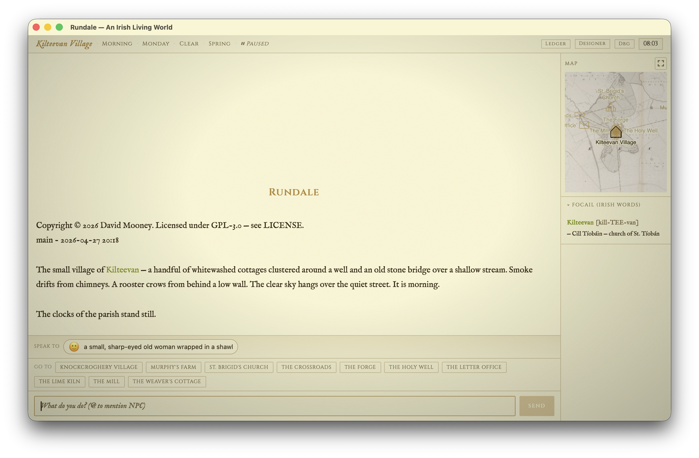
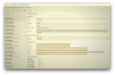
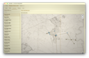
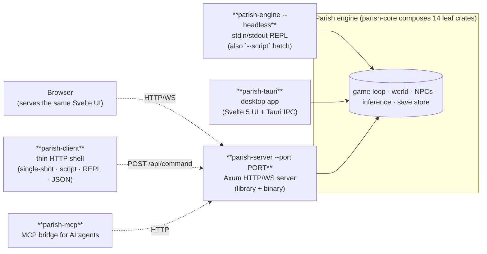
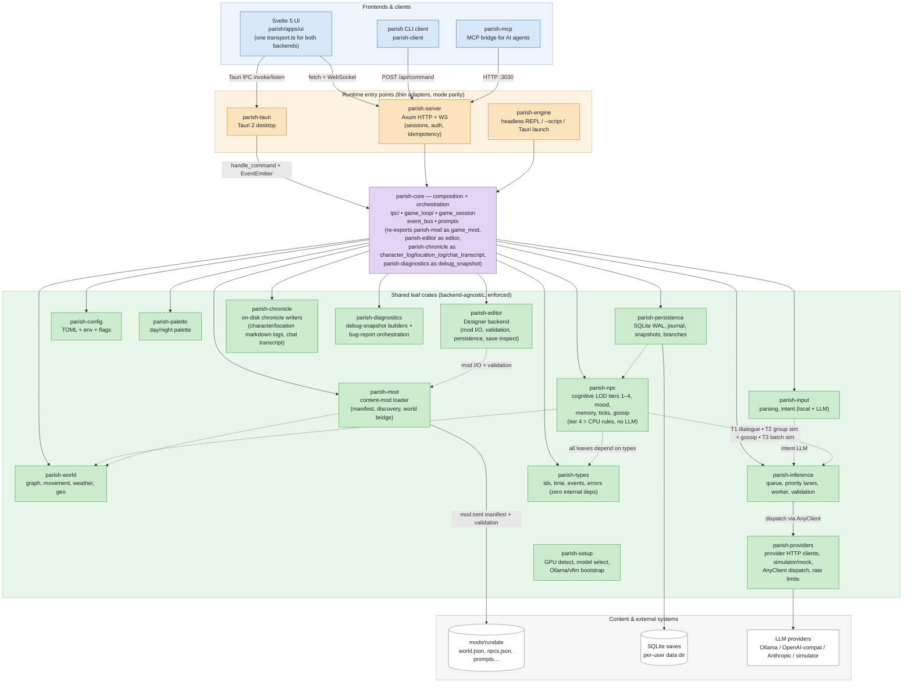

# Rundale

An Irish Living World Text Adventure, set in 1820 rural Ireland; powered by the custom **Parish** engine. 1820 was chosen as it in the middle of the period after the [Acts of Union 1800](https://en.wikipedia.org/wiki/Acts_of_Union_1800) that brought Ireland into the United Kingdom of Great Britian and Ireland, and prior to the [Great Famine](<https://en.wikipedia.org/wiki/Great_Famine_(Ireland)>).

The player arrives as a newcomer to Kilteevan Village, about two miles south-east of Roscommon town in County Roscommon. The village and surrounding area is populated with numerous non-player characters. NPCs are driven by LLM inference. A cognitive level-of-detail (LOD) system simulates NPCs at varying fidelity based on proximity to the player. The geography is based on real early 19th century Ireland. The characters and establishments are fictional.

[](docs/screenshots/rundale.png)

<table>
  <tr>
    <td align="center"><a href="docs/screenshots/map.png"><br/><b>Map</b></a></td>
    <td align="center"><a href="docs/screenshots/ledger.png"><br/><b>Ledger</b></a></td>
    <td align="center"><a href="docs/screenshots/npc-designer.png"><br/><b>NPCs</b></a></td>
    <td align="center"><a href="docs/screenshots/location-designer.png"><br/><b>Locations</b></a></td>
  </tr>
</table>

## Ways to run Parish

Four binaries built from this workspace, each with a single job:


```mermaid
flowchart LR
    subgraph Engine["Parish engine (parish-core composes 14 leaf crates)"]
        Core[("game loop · world · NPCs · inference · save store")]
    end

    Repl["**parish-engine --headless**<br/>stdin/stdout REPL<br/>(also `--script` batch)"]
    Tauri["**parish-tauri**<br/>desktop app<br/>(Svelte 5 UI + Tauri IPC)"]
    Server["**parish-server --port PORT**<br/>Axum HTTP/WS server<br/>(library + binary)"]

    Browser["Browser<br/>(serves the same Svelte UI)"]
    Client["**parish-client**<br/>thin HTTP shell<br/>(single-shot · script · REPL · JSON)"]
    MCP["**parish-mcp**<br/>MCP bridge for AI agents"]

    Repl --> Core
    Tauri --> Core
    Server --> Core
    Browser -. HTTP/WS .-> Server
    Client -. POST /api/command .-> Server
    MCP -. HTTP .-> Server
```

| Binary          | Mode                                                                        | Has engine in-process?              | When to use                                                                                                               |
| --------------- | --------------------------------------------------------------------------- | ----------------------------------- | ------------------------------------------------------------------------------------------------------------------------- |
| `parish-tauri`  | `just run`                                                                  | yes                                 | Default desktop experience — full GUI.                                                                                    |
| `parish-engine` | `--headless` (`just run-headless`), `--script FILE`                         | yes                                 | Single-process terminal play; deterministic `--script` runs drive the test harness.                                       |
| `parish-server` | `--port PORT` (`just web`)                                                  | yes (one engine per cookie session) | Multi-user web server; serves the same Svelte UI; the target for `parish-client`, MCP, and browser sessions.              |
| `parish-client` | single-shot / `--script` / `--json` / REPL (`cd parish && just run-client`) | **no — thin shell**                 | Drive a running `parish-server` over HTTP. Use from scripts, CI, or as a lightweight terminal alternative to the browser. |
| `parish-mcp`    | MCP server (`bash parish/scripts/parish-mcp-backend.sh start`)              | no — bridge                         | Expose `mcp__parish__*` tools to AI agents (Claude Code, etc.). Also bridges over HTTP to a running backend.              |

Shared rule: **mode parity**. Every gameplay feature behaves identically across Tauri, headless, and web. Shared orchestration lives in `parish-core`; entry-point crates contain only thin wiring (see [docs/agent/architecture.md](docs/agent/architecture.md)).

## Features

### World simulation

- **Location graph** with fuzzy (Jaro-Winkler) name resolution, prose-described edges, and per-edge traversal counts that drive a "worn paths" map visualization.
- **Hybrid geography**: locations can be real-world (geocoded from OSM), author-pinned, or fully fictional, with relative anchors that let fictional clusters subordinate to a real place.
- **Game clock** with seven time-of-day phases (Midnight → Night) and a configurable real-to-game speed factor (Slowest 80 min/day → Ludicrous ~100 sec/day) tunable at runtime via `/speed`.
- **Four seasons** with seasonal NPC schedules, weather biases, and Tier 4 life-event rates.
- **Weather state machine** — seven states (Clear → PartlyCloudy → Overcast → LightRain → HeavyRain → Storm, plus Fog), adjacent-state-only transitions, 2-hour minimum dwell, season-biased probabilities. NPCs seek shelter in heavy rain.
- **Weather-gated travel** — hazard-tagged routes can become impassable in storms or slower in heavy rain and fog, with alternate-route pathfinding where available.
- **Travel & encounters** — per-edge travel time from lat/lon and transport mode (walk vs. horse/cart), with time-of-day-weighted en-route encounters.
- **Festivals** — Imbolc, Bealtaine, Lughnasa, Samhain trigger relationship boosts and narrative hooks.
- **Mythology hooks** — locations carry a `mythological_significance` field that's surfaced into NPC prompts and reserved for future folklore systems.

### NPCs — cognitive level-of-detail

A four-tier simulation that scales hundreds of NPCs at varying fidelity based on proximity to the player:

- **Tier 1 (interactive)** — full LLM dialogue, conversation history, gossip recall, memory-augmented prompts; routed through the highest-priority inference lane.
- **Tier 2 (nearby)** — lighter LLM ticks every ~5 game-minutes within ~100 m, producing mood/relationship deltas and overheard conversations.
- **Tier 3 (distant)** — daily batch inference, 10 NPCs per LLM call, on the lowest-priority lane.
- **Tier 4 (far)** — CPU-only probabilistic rules: birth/death/illness/marriage/trade per season, no LLM cost.
- **Memory** — 20-entry short-term ring buffer per NPC with auto-promotion to keyword-indexed long-term memory; persists across tier deflation.
- **Gossip network** — 60 % transmission probability with 20 % distortion on each hop; bystanders overhear and propagate.
- **Six-axis intelligence profile** (verbal, analytical, emotional, practical, wisdom, creative) shapes prompt guidance and speech patterns.
- **Season-aware schedules** with hourly activity/location entries and per-season overrides.
- **Autonomous NPC chains** — after a player turn, NPCs may chain up to three follow-on exchanges driven by relationship strength and mood.
- **Off-screen social simulation** — NPCs interact with one another independent of the player's presence. Tier 2 and Tier 3 inference ticks resolve relationship events, mood shifts, and story beats between non-player characters; outcomes are persisted to world state, progress each NPC's personal story, and surface later as gossip. The world moves forward whether the player is there to witness it or not.
- **Anachronism filter** — ~60-term registry (each entry tagged with origin year and category) flags out-of-period vocabulary in player input so NPCs can react with authentic confusion instead of going along with it.

### LLM inference

- **15 inference providers** out of the box: Ollama, LM Studio, vllm-mlx (Apple Silicon native), OpenAI, Anthropic (native `/v1/messages` API, not the OpenAI-compatibility shim), Google Gemini, OpenRouter, Groq, xAI Grok, Mistral, DeepSeek, Together AI, Custom (any OpenAI-compatible base URL), and a built-in offline Simulator that needs no model download. (Additional providers are available via mod-loaded configurations — Cohere, GitHub Models, Qwen, Zhipu, OpenCode Zen, and others.) Local profiles are available for macOS (vllm-mlx) and Linux/Windows (vLLM/Ollama), but none currently passes Rundale's production dialogue promotion gate; first-run setup labels them experimental and recommends BYOK cloud for player dialogue.
- **Per-category routing** — Dialogue, Simulation, and Intent can each use a different provider/model/key, switchable at runtime via dot-notation commands (`/provider.dialogue`, `/model.intent`, `/key.simulation`).
- **Measured cloud-dialogue default** — OpenRouter's recommended preset uses `google/gemini-3.6-flash` with the qualified low-reasoning production profile. The retained multi-family judgments, individual API calls, and latency evidence are published in the local qualification dashboard rather than inferred from general-purpose benchmarks.
- **Three-lane priority queue** — Interactive (player dialogue) preempts Background (Tier 2) preempts Batch (Tier 3); a slow batch call cannot block your conversation.
- **Token streaming** with bounded back-pressure (1024-token channel) so a slow consumer never OOMs the engine.
- **Structured JSON output** — NPC turns return `{mood, action, internal_thought, irish_words}`; partial JSON is recovered on truncation.
- **Reachability + timeout knobs** — request, streaming, model-load, and download timeouts all configurable per-environment.
- **Bounded inference log** — recent calls (model, latency, sizes, errors) surface in the debug panel without unbounded memory growth.
- **Five-layer prompt-injection defence** (ADR-010) — role separation, delimited input with "sandwiched" instructions, input sanitisation at the system boundary, strict output parsing/validation, and output filtering before display.

### Player experience

- **Free-text dialogue** parsed by an LLM intent extractor (Move / Talk / Look / Examine / Interact), with a regex fallback.
- **`@mention` targeting** to address a specific NPC in a crowded room.
- **Slash-command surface** spanning save management, time control, provider config, debug, theming, and map switching — the same set works in the GUI, web, and CLI.
- **Chat-first play screen** — the readable transcript, enriched command input, nearby people, language hints, map context, and status are available on the default desktop and mobile route.
- **Responsive illustrated context** — approved watercolor scene plates, NPC portraits, and a selected map icon render as ordinary responsive DOM images without a canvas renderer.
- **Coordinated secondary surfaces** — Map, Save/Load, Debug, Mod, Bug Report, and shortcuts share one presentation-neutral coordinator with focus restoration and required-mod blocking.
- **Streaming responses** rendered word-by-word in the visible transcript with smooth per-chunk timing.
- **Emote rendering** — `*nods thoughtfully*` italicized inline.
- **Message reactions** — emoji palette persisted with the save and shown beneath transcript messages.
- **Enriched chat input** — plain text, NPC addressing, slash/model/location completion, input history, multiline editing, and quick travel submit through the existing engine path.
- **Focail sidebar/mobile panel** — Irish vocabulary and NPC names accumulate with pronunciation hints as you encounter them.
- **Durable assigned work** — concrete NPC jobs enter an authoritative task ledger; matching physical actions advance them from assigned to in progress, publish semantic events, survive save/load and journal recovery, and appear independently of the input draft. Gated by the default-on `player-task-progression` flag.

### Persistence & branching

- **Crash-safe SQLite** in write-ahead-log mode — three-table schema (`branches`, `snapshots`, `journal_events`); readers never block writers, so autosave can fire mid-conversation without hitching.
- **Git-style branching** — `/fork <name>` creates a non-destructive branch from the current state; `/load` switches; `/branches` lists.
- **Autosave** every 45 s (configurable) plus manual `/save` and graceful-shutdown autosave on `/quit`.
- **Append-only journal** of game events alongside snapshots, enabling deterministic replay from any snapshot + subsequent events.
- **Cross-process save lock** prevents two instances from corrupting the same save.
- **Save picker** in both GUI (DAG visualization of branches) and headless modes.

### Desktop GUI (Tauri 2 + Svelte 5)

- **Chat-first Svelte play surface** — the default desktop and mobile viewport uses semantic DOM controls and a readable transcript.
- **Responsive composition** — desktop keeps map and nearby context beside chat; mobile keeps chat and input primary with explicit Map and People & Words controls.
- **MapLibre GL parish overlay** with historic 1840s OS Ireland tiles or modern OSM, custom SVG icons per location type, traversal-weighted edges, and click-to-travel, opened from the Map card or `M`.
- **Animated travel** — when the player moves between locations the map smoothly pans and zooms to the destination, interpolating both center and zoom level across the journey's duration so the post-travel view is already framed when the player arrives.
- **Status and context chrome** — location, time, weather, season, festival, and pause state remain legible while secondary tools stay out of the primary conversation flow.
- **Three themes** selectable with `/theme` — default cream/parchment, Solarized Light, Solarized Dark — driven by CSS custom properties and persisted in `localStorage` so reloads don't flash the wrong palette.
- **Coordinated Debug records** (F12) — eight tabs (Overview, NPCs, World, Weather, Gossip, Conversations, Events, Inference) in one modal surface.
- **Bug reporter** — opened from Developer tools or a 🐛 next to a debug record; it captures the visible DOM game state, recent logs, and current game state and files a GitHub issue on the configured repo (`dmooney/rundale` by default), embedding the screenshot inline. Per-record buttons attach the exact inference call / event / conversation as context. Every report also carries a "black box" diagnostic payload — the raw LLM prompt/response history, the canonical `get_engine_state` snapshot, and the last raw user intent — so local-inference drift is reproducible. Also available to auto-QA agents via the `parish_file_bug` MCP tool. Gated by the default-on `bug-report` flag; configured via `PARISH_BUG_REPORT_TOKEN` / `PARISH_BUG_REPORT_REPO`, with `PARISH_BUG_REPORT_DRY_RUN=1` writing the report to disk instead of filing.
- **MCP automated-QA loop** — the `parish_engine_state` MCP tool exposes the canonical, deterministic engine state (active scene, clock, weather, player, NPCs, gossip grapevine) so an agent can assert the UI resolved each state transition. The `parish/scripts/parish-mcp-audit.sh` lifecycle script wraps a strict Init → Execute → Validate (UI vs `get_engine_state`) → Teardown (file a bug on mismatch, kill the backend cleanly) loop. Gated by the default-on `engine-state` flag.
- **Save picker** (F5) with a DAG visualization of branches and inline fork form.
- **Keyboard shortcuts** — F2 screenshot, F5 Ledger, F10 demo, F11 fullscreen, F12 Debug, M map, `?` help, Tab through semantic controls, Enter activate/send, and Esc close a dismissible surface or stop the demo.
- **Parish Designer** — integrated GUI editor at `/editor` for authoring NPCs, locations, schedules, and mod data without touching JSON directly; see the [Parish Designer](#parish-designer-gui-editor) section below.
- **Accessibility** — ARIA-labelled controls, visible focus rings, semantic HTML, WCAG-AA contrast across all theme variants.

### Web server

- **Axum backend** in `crates/parish-server` serves the same Svelte UI over HTTP + WebSocket, one isolated session per `parish_sid` cookie.
- **Auth** — Cloudflare Access JWT validation in production, optional Google OAuth, loopback bypass for local dev, fail-closed when misconfigured.
- **WebSocket events** for world updates, streaming tokens, theme changes, and map source switches.
- **Per-session save isolation** — game state lives under `<user-data>/saves/<session_id>/` and survives restarts. The user-data root is platform-native (`~/Library/Application Support/Rundale` on macOS, `$XDG_DATA_HOME/rundale` on Linux, `%APPDATA%\Rundale` on Windows) and named after the active mod's `save_root`. Override with `PARISH_SAVES_DIR` (saves), `PARISH_TILE_CACHE_DIR` (tile cache), or `PARISH_USER_DATA_DIR` (root).
- **Prometheus-style `/metrics`** for auth failures, session counts, and inference call stats.
- **Deploy artifacts** — multi-stage `Dockerfile` in `deploy/`.

### Headless / CLI

- **`parish-engine`** — single-process binary with two modes: `--headless` (stdin/stdout REPL), `--script FILE` (deterministic batch driver), no flag (Tauri-launch). HTTP serving is no longer muxed in — `parish-server` is now a runnable binary in its own right.
- **Plain stdin/stdout REPL** for scripting, fixtures, and headless servers.
- **Interactive save picker** with the same branch model as the GUI.
- **ANSI-coloured output** matching the GUI palette (NPC names, system messages, errors).
- **`--script <file>`** mode for deterministic JSON-in/JSON-out execution — the backbone of the test harness.
- **The full slash-command surface** works identically to the GUI.

### Thin HTTP client (`parish-client`)

- **Separate `parish` binary** that talks to a running `parish-server` over HTTP — no engine in-process, no game state owned locally.
- **Four modes:** `parish "<cmd>"` single-shot, `parish --script <file>` for batch fixtures, `parish` no-arg REPL, `parish --json "<cmd>"` for raw `CommandResponse` JSON suitable for piping into `jq` / automation.
- **Cookie persistence** — the server's `parish_sid` cookie is saved between runs so subsequent invocations resume the same save branch.
- **Use cases:** CI scripts, agent harnesses, lightweight terminal play against a remote or local server, anything that doesn't want to boot the full engine just to issue a command.

### Modding & content

- **`mod.toml` manifest** declares world, NPCs, prompts, anachronisms, festivals, encounters, transport, pronunciations, UI overrides, and loading-screen text.
- **`world.json`** — locations with id, description templates, lat/lon, indoor/public flags, edge connections, mythological significance, and a `geo_kind` (real / manual / fictional).
- **`npcs.json`** — full NPC schema with personality, six-axis intelligence, home/workplace, mood, and per-season hourly schedules.
- **Editable prompt templates** — separate Tier 1 system, Tier 1 context, and Tier 2 system files plus a configurable historical-period preamble.
- **Anachronism registry** — JSON file of dated terms; modders can extend it for other periods.
- **Festivals, encounters, transport speeds, and Irish-word pronunciations** are all data-driven.
- **Backend-agnostic loading** — the same mod loads identically in Tauri, the web server, and the test harness.

### Parish Designer (GUI editor)

A GUI editor embedded in the SvelteKit UI at the `/editor` route, accessible from both the Tauri desktop app and the web server (`PARISH_ENABLE_EDITOR=1`). Follows the mode-parity rule — every editor command is implemented once in `parish-core` and wired to both backends.

- **Mod browser** — lists all mods under `mods/`, switch between them without restarting.
- **NPC editor** — edit identity, six-axis intelligence (tunable via sliders), home/workplace (location picker, no id-memorizing), knowledge items, gossip seeds, and relationships with automatic bidirectional bookkeeping.
- **Schedule timeline** — read-only 24-hour SVG band per season/day-type showing when each NPC is where.
- **Location editor** — description templates with live placeholder preview (`{time}`, `{weather}`, `{npcs_present}`), lat/lon, indoor/public flags, and connection editing with enforced bidirectional edges.
- **Cross-reference validator** — runs `WorldGraph::validate()` plus orphan NPC homes/workplaces, broken relationship targets, and schedule location refs; click any issue to jump to the field.
- **Save inspector** — browse `.db` save files, branches, and snapshots; view deserialized world state (clock, weather, NPCs, gossip network, conversation log); export a snapshot as a fixture JSON.
- **Deterministic JSON writer** — stable key ordering and 2-space indentation on every save so `git diff` stays clean even after a no-op round-trip.
- **Running-game isolation** — the editor operates on a fresh in-memory copy of mod files and never touches the live game session; a warning banner appears when the loaded mod matches the one being edited.

### Developer & modder tooling

- **`parish-geo-tool`** — Overpass-API CLI that pulls real Irish features into `world.json` by named area or bounding box, with cached responses, dry-run preview, hand-curated merge mode, and a `realign-coords` utility for snapping to historical map coordinates.
- **`parish-npc-tool`** — SQLite-backed NPC builder: bulk-generate parish or county populations with seedable randomness and 1820s demographic weights, query/filter by parish/occupation/tier, edit moods, promote tiers, batch-elaborate backstories with an LLM, validate referential integrity, and export/import JSON. Also splits the monolithic `mods/rundale/npcs.json` catalogue into per-NPC source files (`split-catalog`) and re-joins them into a byte-identical canonical file (`join-catalog`), with a standalone `validate-catalog` integrity pass.
- **`parish-harness`** — headless game quality-control harness: runs automated multi-turn playtests where an LLM plays the player and an LLM judges the finished transcript, against `parish-server` over HTTP. Each run captures canonical engine state and a rendered telemetry "state-frame" per turn—not a player-visible UI screenshot; evaluates deterministic hard-fail **gates** (crash / parser-reject / timeout / empty-turn-burn); scores ~7 quality **axes** (0–100) when gates pass; records findings; and persists everything to SQLite plus on-disk artifacts. The Tauri bridge does not expose the `/api/command` endpoint this client uses, so desktop/UI quality is covered separately by the live MCP quality harness and Playwright lanes. Run knobs (engine models per category, feature flags, player persona, judge rubric pinned by sha256) are content-addressed for exact A/B comparison and correlated with git history. The player/judge seam runs either deterministic scripted actors (CI, no key) or `parish-inference`-backed LLMs (Anthropic / OpenAI-compat / local vllm-mlx). Drive with `cargo run -p parish-harness -- run --config <cfg> --turns N` against a running server. For a **fully headless real-model game** to drive, boot the web server with `parish-server --headless-models` (or `PARISH_HEADLESS_MODELS=1`): it detect-reuses (or spawns) the bundled vllm-mlx Qwen two-slot loadout and binds the four inference categories to it, so `POST /api/command` produces genuine NPC dialogue. The harness applies per-run **BYOK** model overrides (`engine_models.<category>`) through runtime slash commands over `/api/command`, resolving provider keys from the harness environment at apply-time (never persisted into the content-addressed run config). For unattended CI/cron runs, `parish-harness run --player api --judge api` is driven solely by env API keys—no Claude Code session, MCP, or subagent queue—and `--player`/`--judge` select each actor's driver independently.
- **`parish-scenario`** — versioned YAML regression runner for agents and CI. Every step drives the shipping `parish_core::game_loop`, mocks only inference, and evaluates explicit assertions over emitted IPC events and post-step state. Run all scenarios with `just scenario-test` or print one JSON report with `just scenario-run <file>`.
- **Legacy script harness** — `test_*.txt` fixtures in `testing/fixtures/` retain compatibility coverage through structured `ScriptResult` output. One-off demonstrations are separated under `testing/proofs/` and are not counted as regression tests merely because they execute without crashing.
- **Eval rubrics & baselines** — snapshot `Vec<ScriptResult>` JSONs in `testing/evals/baselines/`, with structural rubrics that gate against empty look descriptions, frozen clocks, and anachronistic vocabulary.
- **Architecture fitness tests** — `crates/parish-core/tests/architecture_fitness.rs` mechanically enforces leaf-crate purity (no `tauri`/`axum`/`tower` in shared logic), CLI-vs-leaf duplication bans, and orphaned-module detection. Each failure prints a self-correcting hint.
- **`justfile`** with ~50 recipes grouping build, test, harness, lint, screenshots, deps, geo/NPC tooling, Ollama control, and local CI via `act`.
- **Witness-marker scan** — `just witness-scan` rejects AI completion stubs (the usual `todo!` and ellipsis-comment patterns) in changed files.
- **Doc-path validator** — `just check-doc-paths` ensures every backtick-cited file path in `docs/` actually exists.
- **Frontend test stack** — Vitest unit tests, Playwright E2E with mocked Tauri IPC, screenshot baselines (`just screenshots`).

### Documentation

- **`docs/index.md`** is the master hub — phase status, design overview, ADR index, plans, research, and agent guides.
- **Architectural Decision Records** record the rationale behind graph-based worlds, cognitive LOD, SQLite write-ahead-log persistence, git-like branching, JSON-structured LLM output, real geography, per-category inference, and the geo-tool OSM pipeline.
- **Historical research archive** — religion, family, education, crafts, food, transportation, and Hiberno-English dialect notes informing NPC dialogue.
- **`docs/agent/`** — slim, indexed reference for AI coding agents (build, architecture, style, gotchas, harness, skills, git workflow), linked from `CLAUDE.md` and `AGENTS.md`.

## Model leaderboard

Rundale ships with its own reproducible LLM benchmark that scores models as the engine's NPC brain — in-character dialogue, reaction, world simulation, intent, and Gaeilge (Irish-language) fluency — then prices each candidate against real gameplay token volume. The **v2 promptfoo suite** is the benchmark of record; the v1 harness is archived.

- **Live results:** [dmooney.github.io/Rundale](https://dmooney.github.io/Rundale/) — the ranked v2 leaderboard: per-category scores with 95% bootstrap CIs, a quality-vs-cost efficiency frontier, cost tiers, per-model drill-downs, and the methodology. (Populates once the first funded run lands; until then it renders the schema.)
- **Reproducible harness:** [`promptfoo/`](promptfoo/) — the v2 benchmark of record. The v1 harness is archived under [`rundale-bench/`](rundale-bench/).
- **Static snapshot:** `promptfoo/leaderboard/leaderboard.md` + `leaderboard.jsonl` (append-only history), committed once the first funded run is recorded.

## AI disclosure

Rundale/Parish is an experiment in building a world too detailed and too improvisational to author by hand. The premise is that AI can simulate a parish of hundreds of NPCs (or more) at varying fidelity, generate their dialogue and reactions on the fly, and remain coherent over long play sessions. I wanted to build something using AI that would be impossible any other way, at least for a solo dev.

To that end, the project is developed entirely by AI coding agents — mostly **Claude Code**, with **Codex** and **Gemini** on specific tasks. Quality control is an evolving combination of agents reviewing each other's work and extensive automated checks — the architecture-fitness tests, gameplay harness, eval rubrics, and snapshot baselines described above are designed to keep AI-written code honest. Human play-testing is the final gate.

Static game content for the Ireland in 1820 setting in `mods/rundale/` — NPC personalities, schedules, relationships; location descriptions, lore, pronunciations — is also AI-generated, but human-reviewed before it lands.

Character dialogue, mood, and behaviour are generated **in real time** by whichever LLM provider you've configured. Every NPC line, gossip rumour, and Tier 2/3 simulation tick comes from a live model call at play time; nothing is pre-baked. Each playthrough is genuinely different, and the dialogue's quality depends on the model you point the engine at.

## Quick Start

The workspace ships with a [`justfile`](justfile); run `just` for the full set of recipes.

**Requirements:** Rust (edition 2024), [Node.js](https://nodejs.org/) (v20+), [`just`](https://github.com/casey/just) (`cargo install just` or your package manager's equivalent), and an LLM endpoint configured in `parish.toml` or `.env`. See .env.example for environment variables. There is no packaged release yet.

```sh
# One-time: install system deps, Rust, Node, and frontend packages
just setup
```

### GUI Mode (Tauri Desktop App)

The default experience is a desktop app.

```sh
just run          # launches cargo tauri dev
```

### Other ways to run

```sh
just run-headless                     # stdin/stdout REPL, engine in-process
just web                              # Axum web server on :3001 (Svelte UI in browser)
cd parish && just run-client          # thin HTTP REPL against just-web
```

Single-shot / scripted / JSON modes for `parish-client`:

```sh
cargo run -p parish-client -- "look"                                # one command, formatted output
cargo run -p parish-client -- --script testing/proofs/play_X.txt  # batch fixture
cargo run -p parish-client -- --json "look" | jq .outcome           # raw CommandResponse JSON
```

See the [Ways to run Parish](#ways-to-run-parish) diagram for how these binaries fit together.

### Packaged macOS build with bundled local inference

For a shippable `.app` that ends users can double-click — no Python or
`vllm-mlx` install required — build the inference bundle first, then
the app:

```sh
just build-vllm-mlx-bundle    # ~5 min, ~360 MB compressed, Apple Silicon only
cd parish && cargo tauri build --target aarch64-apple-darwin
```

The first command materialises a relocatable Python runtime with
vllm-mlx pip-installed straight into its site-packages at
`parish/dist/vllm-mlx/python-runtime/` (using `python-build-standalone`'s
`install_only` tarball — no venv, since absolute paths in `pyvenv.cfg`
would break when the bundle moves into `Rundale.app/Contents/Resources/`).
`cargo tauri build` then includes that tree under
`Rundale.app/Contents/Resources/vllm-mlx/python-runtime/`. On first
launch the app detects the bundle and offers the Qwen2.5 local profile
as an experimental option on capable Macs, with its qualification status
shown beside the BYOK recommendation. Choosing local downloads the weights
with a live progress bar.

CI driver: `.github/workflows/build-vllm-mlx-bundle.yml` (manual
trigger, uploads the bundle as an artifact). For dev iteration on
`cargo tauri dev`, you can skip the bundle build — the runtime falls
through to a `PATH`-installed `vllm-mlx` (i.e. `uv tool install vllm-mlx`).

## Architecture

One engine, three thin entry points, fourteen backend-agnostic leaf crates. The full
crate-by-crate map lives in [docs/agent/architecture.md](docs/agent/architecture.md).


```mermaid
flowchart TB
    subgraph clients["Frontends & clients"]
        UI["Svelte 5 UI<br/>parish/apps/ui<br/>(one transport.ts for both backends)"]
        CLI["parish CLI client<br/>parish-client"]
        MCP["parish-mcp<br/>MCP bridge for AI agents"]
    end

    subgraph entry["Runtime entry points (thin adapters, mode parity)"]
        TAURI["parish-tauri<br/>Tauri 2 desktop"]
        SERVER["parish-server<br/>Axum HTTP + WS<br/>(sessions, auth, idempotency)"]
        ENGINE["parish-engine<br/>headless REPL / --script / Tauri launch"]
    end

    CORE["parish-core — composition + orchestration<br/>ipc/ • game_loop/ • game_session<br/>event_bus • prompts<br/>(re-exports parish-mod as game_mod,<br/>parish-editor as editor,<br/>parish-chronicle as character_log/location_log/chat_transcript,<br/>parish-diagnostics as debug_snapshot)"]

    subgraph leaf["Shared leaf crates (backend-agnostic, enforced)"]
        WORLD["parish-world<br/>graph, movement, weather, geo"]
        NPC["parish-npc<br/>cognitive LOD tiers 1–4, mood,<br/>memory, ticks, gossip<br/>(tier 4 = CPU rules, no LLM)"]
        INPUT["parish-input<br/>parsing, intent (local + LLM)"]
        INFER["parish-inference<br/>queue, priority lanes, worker, validation"]
        PROVIDERS["parish-providers<br/>provider HTTP clients, simulator/mock,<br/>AnyClient dispatch, rate limits"]
        SETUP["parish-setup<br/>GPU detect, model select,<br/>Ollama/vllm bootstrap"]
        PERSIST["parish-persistence<br/>SQLite WAL, journal, snapshots, branches"]
        CONFIG["parish-config<br/>TOML + env + flags"]
        PALETTE["parish-palette<br/>day/night palette"]
        MOD["parish-mod<br/>content-mod loader<br/>(manifest, discovery, world bridge)"]
        EDITOR["parish-editor<br/>Designer backend<br/>(mod I/O, validation, persistence, save inspect)"]
        CHRONICLE["parish-chronicle<br/>on-disk chronicle writers<br/>(character/location markdown logs, chat transcript)"]
        DIAG["parish-diagnostics<br/>debug-snapshot builders +<br/>bug-report orchestration"]
        TYPES["parish-types<br/>ids, time, events, errors (zero internal deps)"]
    end

    subgraph external["Content & external systems"]
        MODS[("mods/rundale<br/>world.json, npcs.json, prompts…")]
        DB[("SQLite saves<br/>per-user data dir")]
        LLM["LLM providers<br/>Ollama / OpenAI-compat / Anthropic / simulator"]
    end

    UI -- "Tauri IPC invoke/listen" --> TAURI
    UI -- "fetch + WebSocket" --> SERVER
    CLI -- "POST /api/command" --> SERVER
    MCP -- "HTTP :3030" --> SERVER

    TAURI -- "handle_command + EventEmitter" --> CORE
    SERVER --> CORE
    ENGINE --> CORE

    CORE --> WORLD & NPC & INPUT & INFER & PERSIST & CONFIG & PALETTE & MOD & EDITOR & CHRONICLE & DIAG & TYPES
    INPUT -. "intent LLM" .-> INFER
    NPC -. "T1 dialogue • T2 group sim + gossip • T3 batch sim" .-> INFER
    NPC -.-> WORLD
    PERSIST -.-> NPC
    MOD -.-> WORLD
    EDITOR -. "mod I/O + validation" .-> MOD
    NPC -. "all leaves depend on types" .-> TYPES

    MOD -- "mod.toml manifest + validation" --> MODS
    PERSIST --> DB
    INFER -- "dispatch via AnyClient" --> PROVIDERS
    PROVIDERS --> LLM

    classDef clientNode fill:#d7e7f7,stroke:#4a7aab,color:#1f2328
    classDef entryNode fill:#fae3bd,stroke:#c08a2e,color:#1f2328
    classDef coreNode fill:#e3d3f4,stroke:#8a5fb8,color:#1f2328
    classDef leafNode fill:#cdeccf,stroke:#4f9457,color:#1f2328
    classDef extNode fill:#ffffff,stroke:#777777,color:#1f2328
    class UI,CLI,MCP clientNode
    class TAURI,SERVER,ENGINE entryNode
    class CORE coreNode
    class WORLD,NPC,INPUT,INFER,PROVIDERS,SETUP,PERSIST,CONFIG,PALETTE,MOD,EDITOR,CHRONICLE,DIAG,TYPES leafNode
    class MODS,DB,LLM extNode
    style clients fill:#eef4fb,stroke:#9db8d4,color:#1f2328
    style entry fill:#fdf3e3,stroke:#d8b873,color:#1f2328
    style leaf fill:#e9f6ea,stroke:#9ccca0,color:#1f2328
    style external fill:#f6f6f6,stroke:#bbbbbb,color:#1f2328
```

## Repository Layout

```text
parish/
  crates/              24 workspace members (runtime, scenario/harness tools, and leaf logic crates)
  apps/ui/             Svelte 5 + TypeScript frontend
  testing/fixtures/    scripted gameplay fixtures
  scripts/             Maintenance and quality gate scripts
mods/rundale/          Rundale game content (world, NPCs, prompts, lore)
deploy/                Dockerfile
docs/                  design, ADRs, plans, research, agent guides
justfile               Top-level proxies for common tasks
```

The game icon was generated with **ChatGPT** (OpenAI image generation) from a hand-written prompt and is shipped as-is.

## Documentation

| Start here                                                   | What you'll find                                                                           |
| ------------------------------------------------------------ | ------------------------------------------------------------------------------------------ |
| [docs/index.md](docs/index.md)                               | Master hub — phase status, links to everything                                             |
| [docs/repository-layout.md](docs/repository-layout.md)       | Top-level directory tree and crate index                                                   |
| [docs/troubleshooting.md](docs/troubleshooting.md)           | Bug reporting + inference-log artefact guide                                               |
| [docs/design/overview.md](docs/design/overview.md)           | Architecture, tech stack, module tree, LLM providers                                       |
| [docs/graphics-v2/README.md](docs/graphics-v2/README.md)     | Visual-client research: notebook UI, graphics pipelines, assets, and evidence              |
| [docs/requirements/roadmap.md](docs/requirements/roadmap.md) | Per-item status tracking across all phases                                                 |
| [docs/research/README.md](docs/research/README.md)           | Research documents covering life in 1820's Ireland                                         |
| [docs/adr/README.md](docs/adr/README.md)                     | Architecture decision records and rationale                                                |
| [AGENTS.md](AGENTS.md)                                       | Agent guide — index into [docs/agent/](docs/agent/README.md) for build, style, and gotchas |

## Licence

Rundale on the Parish engine is © 2026 Dave Mooney and is licensed under the
[GNU General Public License v3.0](LICENSE) (`GPL-3.0-only`). Source code is
free to use, modify, and redistribute under the terms of that licence.

"Rundale" and "Parish" are unregistered trademarks of Dave Mooney. The
GPL covers source reuse but not the project names or logos: forks must
rename. (A formal trademark policy lives at `TRADEMARK.md` once published.)

## Credits

Parish is built on a stack of excellent open-source projects, including
[Rust](https://www.rust-lang.org/), [Tokio](https://tokio.rs/),
[Axum](https://github.com/tokio-rs/axum), [Tauri](https://tauri.app/),
[Svelte](https://svelte.dev/) / [SvelteKit](https://kit.svelte.dev/),
[MapLibre GL JS](https://maplibre.org/), [SQLite](https://www.sqlite.org/),
and [Phosphor Icons](https://phosphoricons.com/). Full attribution with
licence texts is in [`THIRD_PARTY_NOTICES.md`](THIRD_PARTY_NOTICES.md); run
`just notices` to regenerate the exhaustive transitive list.

Map data © [OpenStreetMap](https://www.openstreetmap.org/copyright)
contributors, licensed under the
[Open Database Licence 1.0](https://opendatacommons.org/licenses/odbl/1-0/).
Historic 6″ Ordnance Survey Ireland tiles (1829–1842) reproduced with the
permission of the [National Library of Scotland](https://maps.nls.uk/),
licensed under [CC-BY](https://maps.nls.uk/copyright.html). UI icons use
[Phosphor Icons](https://phosphoricons.com/) under MIT.
