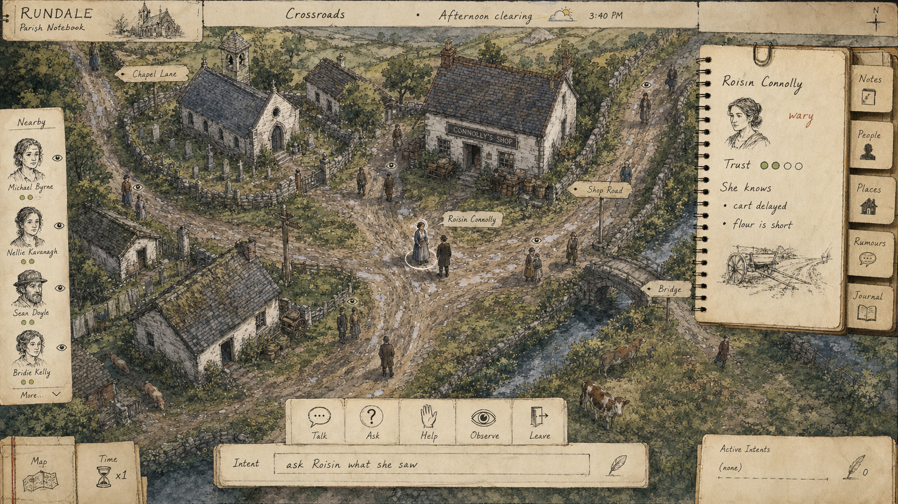

# Illustrated Parish Notebook Prompt

Rendered mockup:



## Prompt

```text
Use case: ui-mockup
Asset type: game interface concept art, 16:9 desktop screenshot mockup
Primary request: Show Rundale concept 7A gameplay at the wider 7C zoom level: a selected NPC conversation interface in a broad isometric parish hub. Variant C: "Illustrated Parish Notebook".

Scene/backdrop: wide isometric hand-illustrated rural Irish parish hub in 1820: crossroads, shop road, chapel lane, bridge, cottages, hedgerows, stone walls, muddy tracks, villagers. Camera is zoomed out like a full hub, not close-up.

Subject: selected NPC conversation gameplay presented with light parchment notebook UI and ink annotation overlays.

Style/medium: hand-inked watercolor isometric illustration, historical notebook aesthetic, softer lower-fidelity art with elegant minimal UI, original and readable.

Composition/framing: full-screen wide isometric illustrated village. Scene has fine ink outlines and watercolor washes. Selected NPC has a hand-drawn circle and small label. Bottom has a parchment strip with conversation options and intent line. Right side has a notebook page pinned open with mood, trust, and known facts. Left side uses small sketched head icons for nearby people. Top uses handwritten-style location/time/weather ribbon.

Lighting/mood: cool gray afternoon with warm paper texture, reflective, literary, intimate while still zoomed out.

Color palette: watercolor greens, gray-blue rain, sepia ink, cream parchment, muted brick red, soft ochre; varied and gentle.

Text (verbatim, keep sparse and legible): "RUNDALE"; "Parish Notebook"; "Crossroads"; "Afternoon clearing"; "Roisin Connolly"; "wary"; "Trust"; "She knows"; "cart delayed"; "flour is short"; "Talk"; "Ask"; "Help"; "Observe"; "Intent"; "ask Roisin what she saw".

UI details: no giant portraits. UI looks like notebook margins and small paper tabs. Action buttons are icon stamps: speech, question, hand, eye, door. Nearby witnesses are marked by tiny ink eye symbols. The conversation panel is slim and leaves most of the wide isometric scene visible.

How it plays visually: player explores a watercolor isometric parish, selects a villager, reads marginal notes about mood and knowledge, chooses a stamped action or writes an intent, and the notebook updates with remembered facts.

Constraints: no fantasy magic, no combat HUD, no weapons focus, no close-up camera, no modern city, no modern clothing, no phones, no exact imitation of any existing game UI, no landing page, no decorative gradient blobs, no watermark.
```
