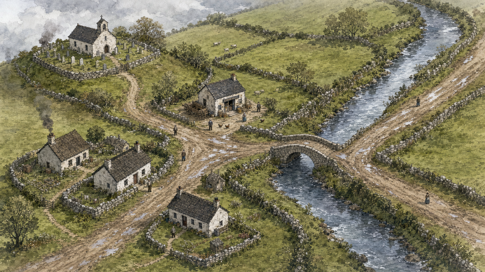

# Illustrated Parish Scene No-UI Prompt

Rendered mockup:



## Prompt

```text
Use case: historical-scene
Asset type: game environment concept art, 16:9 desktop background plate, no UI
Primary request: Generate a wide isometric hand-inked watercolor scene for Rundale, an 1820 rural Irish parish game. This is the playable environment art only: no interface, no labels, no text, no icons, no dialogue panels, no selection rings.

ABSOLUTE LAYOUT REQUIREMENTS, FOLLOW CAREFULLY:
Use a fixed wide isometric camera looking down at a parish crossroads. Describe all positions from the viewer's perspective: upper left, upper right, center, lower left, lower right.

1. River layout: A narrow natural river occupies the right third of the image. It enters the frame from the upper-right edge, flows continuously downward in a gentle S-curve, passes under a stone bridge at center-right, continues visibly beyond the bridge, and exits the frame at the lower-right edge. The river must never stop, vanish, dead-end, split nonsensically, or turn into a path. Both upstream and downstream sections of the river must be clearly visible. The banks must remain continuous on both sides except where the bridge crosses.

2. Bridge layout: Place one small arched stone bridge at center-right, spanning the river from the west bank to the east bank. The bridge crosses the river at roughly a right angle. The bridge must connect two road segments: a west-bank road from the central crossroads and an east-bank road continuing away toward the upper-right edge. The bridge exists only because the river continues under it. Do not put a bridge where the river ends. Do not let paths go around a dead end of water.

3. Main road layout: A muddy main road enters from the lower-left edge, runs diagonally up and right into a central crossroads clearing just left of center, then continues eastward from the crossroads to the stone bridge at center-right. After crossing the bridge, the same road continues on the far east bank toward the upper-right edge and leaves the frame. The road must be continuous and unobstructed. No building, wall, tree, fence, cart, or riverbank should block this main road.

4. Chapel lane layout: From the central crossroads, a secondary lane branches toward the upper-left corner. It climbs gently to a small whitewashed chapel and graveyard on a low rise in the upper-left quadrant. This chapel lane stays entirely on the west side of the river and does not cross the river. It should curve naturally around hedges and stone walls, but remain readable and continuous.

5. Shop and cottage layout: Place a small shop just above the central crossroads, slightly left of the road to the bridge. The shop is set back from the road with a short yard or threshold path connecting the door to the crossroads; it must not sit in the road. Place two or three cottages in the lower-left and lower-center areas, each set back behind low stone walls or hedges. Their doors face small footpaths that connect to the main road, but the cottages do not block the road. No house should sit directly on top of any path.

6. Fields and hedgerows: Put irregular green fields and hedgerows in the upper-center and lower-center spaces between the roads and buildings. Hedges should border fields and lanes; they should not cut across the main road or bridge approach. Stone walls should define property edges but must leave clear gaps where paths pass through.

7. Footpaths: Add a few narrow footpaths only where they make sense: from the cottages to the main road, from the shop yard to the crossroads, and around the chapel graveyard. Footpaths must connect to roads or doors; no isolated decorative path fragments. No footpath should cross the river unless it uses the stone bridge.

8. Terrain logic: The river is the lowest feature. Roads and buildings sit on dry ground above the banks. The bridge approaches are slightly raised and aligned with the road. Puddles can appear in ruts on roads and yards, but not as random disconnected rivers. Trees and hedges grow along field edges and riverbanks, not in the middle of roads.

Scene/backdrop: Rural Ireland in 1820 after rain: muddy lanes, wet grass, low stone walls, hedgerows, whitewashed chapel, small shop, cottages, peat smoke, puddles, cloudy gray afternoon light.

Style/medium: hand-inked watercolor isometric illustration, fine sepia ink outlines, soft watercolor washes, historical parish notebook aesthetic, literary and handmade, original and readable as game environment art. No UI, no text, no labels.

Composition/framing: wide 16:9 isometric hub. Keep the whole crossroads, chapel lane, shop, cottages, bridge, and continuous river visible at once. Use enough negative space between features that the layout can be scrutinized and still makes practical sense.

Lighting/mood: cool gray afternoon after rain, soft overcast light, reflective puddles, warm cream walls, quiet human activity suggested but not crowded.

Color palette: watercolor greens, gray-blue river and rain clouds, sepia ink, cream limewash, muted brick red, soft ochre roads, wet slate shadows, dark peat smoke.

Characters/props: Optional tiny villagers may stand beside roads or yards, but not on the bridge approach or blocking paths. A small cart may be parked beside the shop yard, parallel to the road and off the road surface. Chickens or tools may appear in yards only.

Continuity checks the image must satisfy: the river enters at the upper-right edge and exits at the lower-right edge; the bridge crosses a continuous river; the main road enters lower-left, reaches the crossroads, crosses the bridge, and exits upper-right; the chapel lane branches upper-left without crossing water; every building is set back from paths; all footpaths connect logically; no natural feature or building creates a dead end by accident.

Avoid: UI, labels, text, map pins, icon markers, dialogue panels, selection rings, fantasy magic, combat elements, modern roads, modern vehicles, modern clothing, modern signage, photorealism, decorative gradient blobs, nonsensical rivers, dead-end rivers, bridges over dry ground, paths that stop at nothing, houses sitting in paths, paths crossing water without a bridge, impossible perspective, watermark.
```
