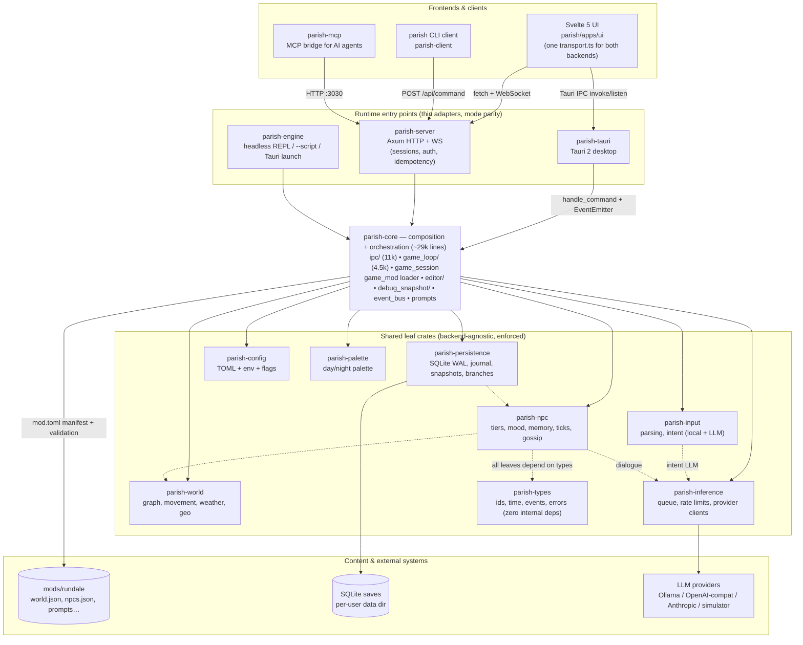

# Architecture Review: Rundale / Parish Engine

**Date:** 2026-06-09
**Reviewer:** Claude Code (architecture review session)
**Scope:** Full repository — Rust workspace (16 crates), Svelte frontend, mod/content
system, persistence, inference pipeline, testing, and CI.

## Summary

The architecture is fundamentally sound. Mode parity is real, not aspirational: a
single shared command dispatch in `parish-core` is wired through thin per-runtime
adapters via the `EventEmitter` trait, and the architecture-fitness test
(`parish/crates/parish-core/tests/architecture_fitness.rs`) mechanically rejects
runtime deps in shared crates, duplicated command match arms, and orphaned files. The
leaf-crate DAG is clean (no cycles, `parish-types` at the root, `reqwest` contained to
`parish-inference`). The frontend has one unified transport
(`parish/apps/ui/src/lib/ipc/transport.ts`) covering both Tauri and the web server.
The engine is genuinely content-agnostic — a second mod needs zero engine changes.

The improvement opportunities cluster in five areas, ordered by impact below. None
are blockers; most are gradual erosion of stated principles rather than design
mistakes.

## System diagram

---

## 1. `parish-core` has outgrown its "thin composition layer" billing (HIGH)

The docs (AGENTS.md, `docs/agent/architecture.md`) describe `parish-core` as a thin
composition crate. Measured today it is **~28.9k lines across 8 subsystems**:

| Module                                          | Lines  | Note                                                                             |
| ----------------------------------------------- | ------ | -------------------------------------------------------------------------------- |
| `parish/crates/parish-core/src/ipc/`            | 11,102 | `handlers.rs` 1,920; `config.rs` 1,277; `bug_report.rs` 1,254; `editor.rs` 1,230 |
| `parish/crates/parish-core/src/game_loop/`      | 4,565  | Coherent, legitimately coupled                                                   |
| `parish/crates/parish-core/src/game_mod/`       | 2,116  | Mod loader                                                                       |
| `parish/crates/parish-core/src/editor/`         | 1,673  | Self-contained Designer subsystem                                                |
| `parish/crates/parish-core/src/debug_snapshot/` | 1,616  | Self-contained introspection subsystem                                           |
| Other (game_session, event_bus, prompts, …)     | ~6,900 | Core orchestration                                                               |

The composition role (re-exporting leaf crates) and the integration role (game loop,
IPC, editor, mod loader) now coexist in one crate, so every large refactor funnels
through it.

**Recommendations** (each a low-risk module move):

- Extract `editor/` into a `parish-editor` crate — it is already a self-contained
  subsystem with its own protocol.
- Extract `debug_snapshot/` similarly, or fold it into a diagnostics crate together
  with `ipc/bug_report.rs` (1,254 lines of bug-report bundling that is thematically
  telemetry, not IPC).
- Update AGENTS.md / `docs/agent/architecture.md` to stop calling `parish-core`
  "thin" — agents plan refactors based on that claim.

## 2. `AppState` lock sprawl in `parish-server` (HIGH)

`parish/crates/parish-server/src/state.rs` holds **~20 independently mutex-guarded
fields** with a documented lock-ordering invariant spanning the full chain
(world → npc_manager → inference_queue → … → save_db). The ordering is enforced only
by comment and review discipline — nothing mechanical catches a handler that acquires
`npc_manager` before `world`, and the failure mode is a silent deadlock.

**Recommendations:**

- Group semantically related fields into sub-structs behind one lock each (e.g.
  an inference group for `client` / `cloud_client` / `inference_queue` / config
  pieces, a save-identity group for `save_path` / `current_branch_id` /
  `current_branch_name`). This shrinks the ordering chain without changing
  behavior — most handlers already acquire these together.
- Encode the canonical order as a `const` schema next to the struct and add a
  debug-build assertion (or at minimum a fitness test that greps handler bodies for
  out-of-order acquisition pairs). The existing fitness-test style — cheap textual
  sensors with self-correction hints — fits this well.
- Add lock-contention metrics before any finer-grained splitting; in a single-player
  session these locks are likely uncontended, so splitting further is premature.

## 3. Single-process scaling: intentional ceiling, avoidable sharp edges (MEDIUM-HIGH)

The single-process design is deliberate and documented
(`docs/adr/003-sqlite-wal-persistence.md`, `docs/adr/014-web-mobile-architecture.md`,
`docs/agent/scaling-rules.md`): in-memory sessions (~50 MB each, capped at 50 with
admission control), sync rusqlite behind `spawn_blocking`, sticky sessions required.
That trade is appropriate for the project. Within it, four sharp edges are worth
fixing:

- **No backpressure on per-event blocking tasks.** Character/location-log processing
  in `parish/crates/parish-server/src/session/ticks.rs` spawns a
  `tokio::task::spawn_blocking` per world event. Under load (many sessions × many NPC
  events) this competes for the global blocking pool with autosave and DB work, with
  no queue-depth visibility. Fix: a bounded semaphore, or one long-lived writer task
  per session fed by a bounded channel.
- **Inference rate limiting is per-category, not per-session**
  (`parish/crates/parish-inference/src/rate_limit.rs`). One session saturating
  Tier-2/3 inference starves every other session's background NPC cognition. Fix:
  per-session quotas or weighted fair queueing in the queue
  (`parish/crates/parish-inference/src/queue.rs`).
- **The idempotency cache does not survive restart**
  (`parish/crates/parish-server/src/middleware.rs`). A replayed mutating request
  within the 24 h TTL executes twice after a deploy. Either persist the cache
  alongside `sessions.db` or document the window as accepted risk.
- **No 429/backoff handling on cloud providers.** A rate-limited cloud response is
  logged but not retried with exponential backoff; bursty NPC ticks can churn
  through failures.

## 4. Frontend debt (MEDIUM)

- **Two oversized components:** `parish/apps/ui/src/components/InputField.svelte`
  (1,076 lines) and `parish/apps/ui/src/components/SetupOverlay.svelte` (945 lines).
  Both bundle several separable concerns (history/autocomplete/input core; wizard
  stages) and are the first places UI regressions hide.
- **Hybrid reactivity:** components use Svelte 5 runes (`$state`/`$derived`) while
  `parish/apps/ui/src/stores/` still uses Svelte 4 `writable`/`readable`. Finishing
  the runes migration would remove a whole class of subscribe-lifecycle bugs.
- **Hand-written type sync:** `parish/apps/ui/src/lib/types.ts` mirrors Rust IPC
  types by hand, validated by `parish/apps/ui/src/lib/types-manifest.json` plus
  parity tests on both sides. The tooling catches drift, but renames remain manual
  three-place edits. Consider generating the TS types from Rust (`ts-rs` or
  `specta`) — it would eliminate the bug class rather than detect it. If the manual
  approach is kept deliberately (simpler build), document the rationale in
  `docs/design/`.

## 5. Testing gaps (MEDIUM)

Coverage is strong overall (2,800+ unit tests, 110+ script fixtures, 56 Playwright
tests against a real server, a 60.8 % coverage ratchet). The gaps are positional:

- **Tauri is the least-tested entry point** — ~25 async tests focused on command
  marshalling vs 166 in `parish-server`, and no desktop e2e. Given rule 12's history
  (#687, #696: drift between entry points), the least-observed adapter is where
  parity drift will land. A small `tauri-driver`-based smoke suite (launch, run a
  command, assert an emitted event) would cover the riskiest seam.
- **`parish-client` has zero CI coverage** despite MCP, CI, and human users all
  depending on the same sync routes. A two-line smoke test against a started server
  (`parish "look"` exits 0 and prints a location) would do.
- **Harness shadow divergence (#1159)** is measured in CI but non-gating
  (`continue-on-error`). Decide: converge the two game-loop paths and make the job
  gate, or retire the measurement — a permanently-yellow job trains people to
  ignore it.
- Playwright runs with `workers: 1` (`parish/apps/ui/playwright.config.ts`); worth
  parallelizing once test isolation allows.

## 6. Smaller items (LOW)

- **Docs drift:** the crate table in `docs/agent/architecture.md` says 16 crates but
  lists 15 — `parish-mcp` is missing. (Fixed alongside this review.)
- **`tokio` leaks into leaf crates** including `parish-types`. Not forbidden, and
  mostly justified (`tokio::sync` primitives), but it contradicts the spirit of
  "backend-agnostic leaf crates" and is undocumented. State the rationale per crate
  or trim where `std`/`crossbeam` suffices.
- **Entry-point wiring files are large but stable:** `parish-server/src/lib.rs`
  (1,909 lines) and `parish-tauri/src/lib.rs` (1,798 lines) are boilerplate
  registration, not logic. Low ROI to change; codegen/macro registration only if
  they keep growing.
- **Proof-gate shell scripts** (`parish/scripts/agent-check.sh` and friends) parse
  JSON with grep/awk; `jq` would be less fragile.
- **`mod.toml` has no schema versioning** — documented as additive-only/"fragile".
  Fine for one first-party mod; add a `schema_version` field before any community
  mod story.

---

## What to preserve

These patterns are working and should be defended in review:

1. **Mode parity via shared core + thin adapters.** Single `handle_command` /
   game-loop in `parish-core`; Tauri, server, and headless adapt over
   `EventEmitter`. The fitness test catches re-implementations.
2. **The architecture-fitness test style** — fast textual sensors with rule numbers
   and canonical-fix hints in every assertion. Extend it (lock ordering, rule 2's
   wiring-parity convention) rather than adding heavyweight tooling.
3. **Trait seams at the right places:** `InferenceClient` (OpenAI-compatible /
   Anthropic / simulator), `SessionStore`, `EventBus` with deterministic test
   implementations. These are exactly the seams a future scaling effort needs.
4. **Unified frontend transport** with runtime detection, WebSocket resync, and
   bounded read timeouts.
5. **Content-agnostic mod loading** with cross-reference validation and round-trip
   schema checks.

## Recommended actions (effort / payoff)

| #   | Action                                                                               | Effort | Payoff  |
| --- | ------------------------------------------------------------------------------------ | ------ | ------- |
| 1   | Extract `editor/` (and optionally `debug_snapshot/` + bug-report) from `parish-core` | Low    | High    |
| 2   | Group `AppState` fields into sub-structs; encode lock order as checked schema        | Medium | High    |
| 3   | Bounded-channel writer (backpressure) for character/location logs                    | Low    | Medium  |
| 4   | Per-session inference quotas                                                         | Medium | Medium  |
| 5   | Split `InputField.svelte` / `SetupOverlay.svelte`; finish runes migration            | Medium | Medium  |
| 6   | `parish-client` CI smoke test                                                        | Low    | Medium  |
| 7   | Tauri smoke e2e suite                                                                | Medium | Medium  |
| 8   | Resolve or retire harness shadow job (#1159)                                         | Medium | Medium  |
| 9   | Generate TS types from Rust (or document why not)                                    | Medium | Low-Med |
| 10  | Docs truth-up: `parish-core` is not thin; tokio-in-leaf rationale                    | Low    | Low     |
