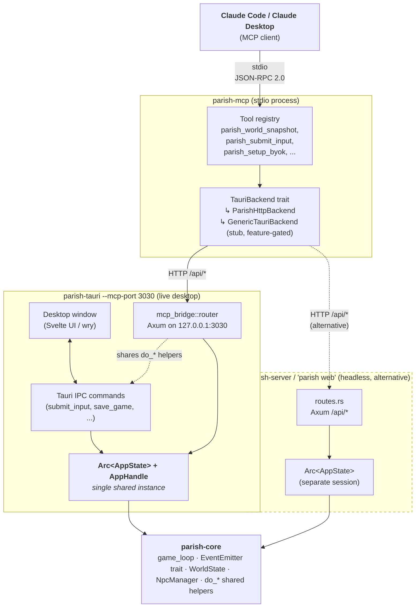

# parish-mcp

A [Model Context Protocol](https://modelcontextprotocol.io) server that lets
LLM clients (Claude Code, Claude Desktop, etc.) drive a running
Parish/Rundale instance — and, in the future, any Tauri app — over JSON-RPC.

## What it does today

Exposes a small, curated set of MCP tools that map onto Parish's IPC surface:

| Tool                       | Effect                                                                                                                                                                                                                                                                                                                                                                                                       |
| -------------------------- | ------------------------------------------------------------------------------------------------------------------------------------------------------------------------------------------------------------------------------------------------------------------------------------------------------------------------------------------------------------------------------------------------------------ |
| `parish_world_snapshot`    | Read the current world snapshot, including non-completed durable tasks in assignment order.                                                                                                                                                                                                                                                                                                                  |
| `parish_map`               | Read the location graph plus the player's position.                                                                                                                                                                                                                                                                                                                                                          |
| `parish_npcs_here`         | List NPCs co-located with the player.                                                                                                                                                                                                                                                                                                                                                                        |
| `parish_engine_state`      | Read the canonical deterministic engine state (`active_scene`, `clock`, `weather`, `player.active_tasks`, `npcs`, `grapevine`) for QA validation — assert the UI and task progression against it after each interaction (#1331, #1781).                                                                                                                                                                      |
| `parish_save_state`        | Read save-file / branch metadata.                                                                                                                                                                                                                                                                                                                                                                            |
| `parish_submit_input`      | Send player input (movement, action, dialogue).                                                                                                                                                                                                                                                                                                                                                              |
| `parish_new_game`          | Start a fresh game on a new branch.                                                                                                                                                                                                                                                                                                                                                                          |
| `parish_save_game`         | Save the current branch.                                                                                                                                                                                                                                                                                                                                                                                     |
| `parish_load_branch`       | Load a named branch by id.                                                                                                                                                                                                                                                                                                                                                                                   |
| `parish_setup_status`      | Reads BYOK setup state: `{complete, provider, model, base_url, has_api_key, has_env_key}`.                                                                                                                                                                                                                                                                                                                   |
| `parish_setup_byok`        | Persists a BYOK provider config (writes key to OS keychain, rebuilds the live inference worker).                                                                                                                                                                                                                                                                                                             |
| `parish_latest_screenshot` | Reads metadata for the most recent player-triggered screenshot (`path`, `taken_at`, `size_bytes`). Capture is initiated by pressing F2 in the live desktop window.                                                                                                                                                                                                                                           |
| `parish_file_bug`          | Files a bug report (`title`, optional `description`/`context`) — bundles a live screenshot + recent logs + game state into a GitHub issue and returns the URL. Auto-appends a black-box diagnostic payload (raw LLM prompt/response history, the `get_engine_state` snapshot, and the last raw user intent — #1331). Dry-run / no-token mode writes the report to disk (`created:false`, `bundle_path` set). |
| `tauri_invoke`             | Generic escape hatch — call any backend command by name.                                                                                                                                                                                                                                                                                                                                                     |

Behind the scenes these go through a [`TauriBackend`](src/backend.rs) trait. The
default implementation (`ParishHttpBackend`) talks to a running
`parish-server` over its `/api/*` HTTP routes; because those routes are
**mode-parity** with the Tauri IPC commands (verified by
`parish-core/tests/wiring_parity.rs`), driving the server is equivalent
to driving the desktop app for everything that participates in the
parity sensor.

A second impl, `GenericTauriBackend`, is a stub for a future
[WebDriver / `tauri-driver`](https://v2.tauri.app/develop/tests/webdriver/)
backend that would drive any Tauri app's webview directly. It is wired
through the same trait so the MCP layer needs no changes when it lands.
It lives behind the off-by-default `generic-tauri-backend` cargo feature, so
the default build never exposes an always-`Unimplemented` backend; enable the
feature to compile the placeholder type.

## Architecture



**Key invariants the diagram encodes:**

- `parish-mcp` is a thin protocol bridge — it never touches game state
  directly. All mutations flow through HTTP to whichever backend is
  configured.
- The desktop path (`parish-tauri --mcp-port`) shares **one**
  `Arc<AppState>` between the Svelte window, the Tauri IPC commands,
  and the embedded Axum bridge. That's what makes MCP-driven inputs
  appear in the live window.
- The headless path (`parish-server`) is an entirely separate process
  with its own `AppState`. Same `/api/*` surface, different session.
  The `wiring_parity` sensor in `parish-core/tests` enforces that the
  two route tables stay aligned.
- Both backends ultimately delegate to the same `parish-core` game
  loop, parameterised over the runtime via the `EventEmitter` trait
  (CLAUDE.md rule #12). New shared logic must land there, not in either
  entry point.

## Transport

The binary speaks **stdio JSON-RPC 2.0**, the standard MCP transport for
Claude Code and Claude Desktop. Each line of stdin is one JSON-RPC
message; each line of stdout is one response. Logs go to stderr.

If you need an HTTP/SSE transport later, the `serve()` function in
[`src/jsonrpc/`](src/jsonrpc/) is generic over `AsyncRead`/`AsyncWrite`
and can be reused unchanged — only the entry point in `main.rs` would
need a second wiring path.

## Running it

There are two backends parish-mcp can drive — pick whichever matches what you
want to control.

### A. Live desktop session (recommended)

Run the Tauri desktop app with the embedded MCP bridge enabled:

```sh
cargo run -p parish-tauri -- --mcp-port 3030
```

The desktop window comes up as usual; in parallel, an in-process Axum
listener binds `127.0.0.1:3030` and exposes a curated subset of the
`/api/*` routes (see [Bridge route subset](#bridge-route-subset) below),
sharing the live `AppState` and `tauri::AppHandle`. Every write the MCP
client sends — `submit_input`, `new_game`, `save_game` — mutates the
running window's world and triggers the same UI events the user would
see if they typed in the input box.

#### Bridge route subset

The Tauri MCP bridge exposes the routes the agent tools actually need
to drive a live session — it is intentionally narrower than the
`parish-server` route table to keep the desktop attack surface small.
The full list lives in
[`parish-tauri/src/mcp_bridge.rs::build_router`](../parish-tauri/src/mcp_bridge.rs);
in summary:

| Category           | Exposed by bridge                                                                                                                                                             | Reads / writes |
| ------------------ | ----------------------------------------------------------------------------------------------------------------------------------------------------------------------------- | -------------- |
| Health & snapshots | `/api/health`, `/api/world-snapshot`, `/api/map`, `/api/npcs-here`, `/api/save-state`, `/api/transcript`, `/api/setup-snapshot`, `/api/debug-snapshot`                        | reads          |
| Player commands    | `/api/submit-input`, `/api/new-game`, `/api/save-game`, `/api/load-branch`                                                                                                    | writes         |
| Screenshots        | `/api/latest-screenshot`, `/api/take-screenshot`                                                                                                                              | read / write   |
| BYOK + onboarding  | `/api/setup-status`, `/api/submit-byok`, `/api/byok-env-keys`, `/api/preset-models`, `/api/list-available-providers`, `/api/onboarding-options`, `/api/start-local-inference` | read / write   |

Routes that `parish-server` ships but the bridge intentionally **does
NOT** expose include `/api/theme`,
`/api/ui-config`, `/api/app-icon.png`, `/api/favicon.png`,
`/api/react-to-message`, `/api/discover-save-files`,
`/api/create-branch`, `/api/new-save-file`, `/api/mods`,
`/api/mods/switch`, `/api/demo-config`, `/api/demo-context`,
`/api/save-screenshot`, `/api/command`, `/api/state`, `/api/ws`, the
`/api/editor-*` family, `/api/session-init`, and `/api/auth/*`. A
request to one of these against the bridge returns
`HTTP/1.1 404 Not Found` — use Setup B (a separate `parish-server`)
when an agent needs the wider surface. The bridge layer's
goal is to drive the live desktop session for gameplay-shaped MCP
tools; deeper introspection and editor-mode mutation are out of scope
by design.

Then run parish-mcp pointed at the same port:

```sh
cargo run -p parish-mcp -- --base-url http://127.0.0.1:3030
```

### B. Headless `parish-server` session

Useful when you want a separate, headless session (e.g. for batched
evaluation or CI). Start a server in one terminal:

```sh
cargo run -p parish --bin parish -- web --port 3030
```

Then run parish-mcp pointed at it:

```sh
cargo run -p parish-mcp -- --base-url http://127.0.0.1:3030
```

The MCP client sees an identical tool surface either way — that's what
`parish-core/tests/wiring_parity.rs` enforces.

It will block waiting for JSON-RPC messages on stdin. From another
shell you can poke it directly:

```sh
echo '{"jsonrpc":"2.0","method":"initialize","id":1}' | \
  cargo run -p parish-mcp --quiet
```

## Wiring it into Claude Code / Claude Desktop

Add an entry like this to your MCP client config (paths and flags
adjusted for your checkout):

```json
{
  "mcpServers": {
    "parish": {
      "command": "/path/to/Rundale/target/debug/parish-mcp",
      "args": ["--base-url", "http://127.0.0.1:3030"]
    }
  }
}
```

If the target server is gated behind Cloudflare Access, set
`PARISH_MCP_AUTH_EMAIL` (or pass `--auth-email`) and the value will be
forwarded as `Cf-Access-Authenticated-User-Email`.

## Testing

```sh
cargo test -p parish-mcp
```

## Future work

Items deferred from the initial PR. None of these block existing tools;
they extend coverage so new use cases can be added without re-thinking
the architecture.

### Screenshot capture extensions

The player-triggered, MCP-readable screenshot path has shipped:
pressing F2 in the live desktop window captures the Svelte UI via
`html-to-image`, the data URL is decoded by the `save_screenshot`
Tauri command, and the resulting PNG is written to
`<saves_dir>/screenshots/parish-<ISO-timestamp>.png`. The MCP
`parish_latest_screenshot` tool reads `{path, taken_at, size_bytes}`
back through the bridge.

Two extensions remain open:

1. _MCP-trigger._ Today the model can only _read_ the latest saved
   file; it cannot ask the live window to capture one. Adding
   MCP-trigger means an event round-trip in `mcp_bridge.rs`: store a
   oneshot `Sender` keyed by request id in a new `pending_screenshots:
Mutex<HashMap<String, oneshot::Sender<...>>>` field, emit a
   `request-screenshot` Tauri event, await the receiver with a
   reasonable timeout (~10 s). The frontend already has a `request_id`
   plumbing pattern for similar flows; ~50 extra lines.

2. _Inline image vs. path-only in the MCP response._ MCP `tools/call`
   responses support `content: [{type: "image", data: "<base64>",
mimeType: "image/png"}]` so the model can see the screenshot
   directly. Today the parish-mcp envelope only emits text parts (see
   `tool_call_result` in `src/mcp.rs`). Returning an image part means
   adding a `returns_image` flag to `ToolDef` and a parallel branch in
   `call_tool`. Worth it once we have a vision-capable client routinely
   driving the bridge; otherwise path-as-text is fine and the model
   reads the file via a Read tool.

### Other deferred items

- **Event push (`notifications/*`).** Today the model has to poll
  `parish_world_snapshot` between turns to see NPC reactions, weather
  ticks, autosave fires, and setup progress. A `WebSocket → MCP
notification` fan-in would let the bridge push these proactively. ~80
  lines, mostly in `mcp_bridge.rs` and a new `pending_notifications`
  channel on `McpServer`.

- **`GenericTauriBackend` (WebDriver).** The `BackendError::Unimplemented`
  stub (behind the off-by-default `generic-tauri-backend` feature) is wired
  through the `TauriBackend` trait so a future
  [`tauri-driver`](https://v2.tauri.app/develop/tests/webdriver/) impl
  drops in without protocol changes. Unblocks DOM-level driving (click
  selectors, read visible text, real screenshots of the OS window) and
  app-agnostic Tauri control beyond Parish.

- **Editor + debug surfaces as curated tools.** `editor_*` and
  `get_debug_snapshot` are reachable today only via `tauri_invoke` (no
  schema validation). Curated tools would tighten the model's
  affordances and self-document the editor flow.

- **Server-mode BYOK parity.** `parish_setup_status` / `parish_setup_byok`
  are wired against the in-process Tauri MCP bridge (single `AppState`
  shared with the desktop window). `parish-server` does not yet expose
  the matching `/api/setup-status` and `/api/submit-byok` HTTP routes,
  so the MCP tools only work against a running Tauri instance until
  multi-user web BYOK is designed.

The crate ships unit tests for:

- JSON-RPC framing (round-trip, notifications, parse errors)
- backend HTTP behaviour (against a `wiremock` mock server)
- tool argument validation and command translation
- MCP handshake and `tools/call` dispatch
